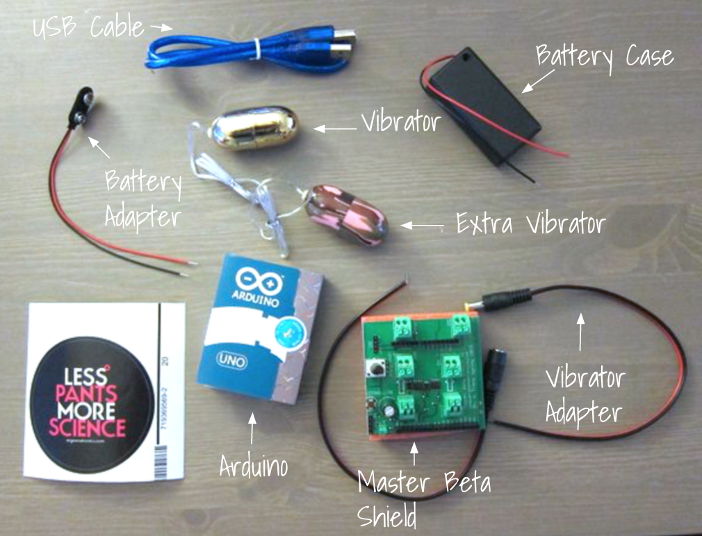
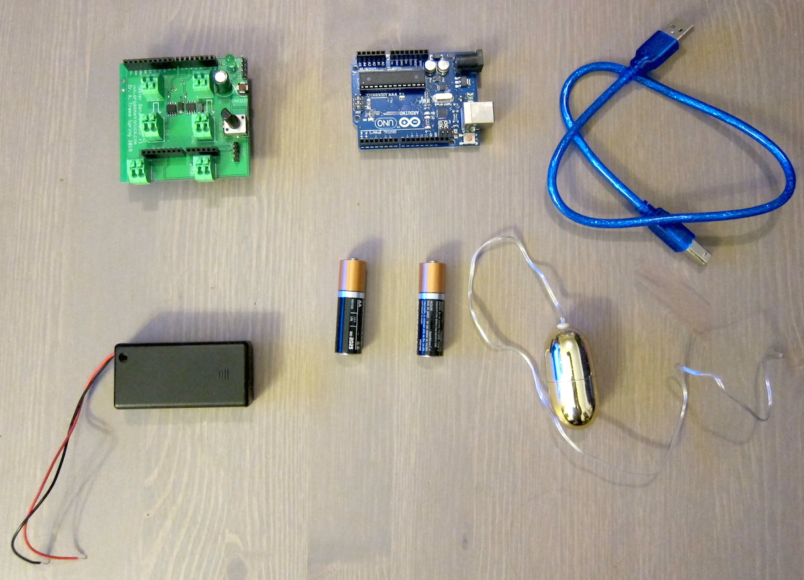

# Assembling our Sex Robot
Here is everything that comes with the Master Beta kit: 
 <ul><li><b>USB cable</b>: used for connecting the Arduino to a computer in order to pass data back and forth.</li></ul>

We'll also need 2 AA batteries that aren't included in the kit. We won't be using the battery adapter, vibrator adapter, or extra vibrator today, so that leaves us with: 
