# Assembling our Sex Robot
Here is everything that comes with the Master Beta kit: 
 
<ul><li><b>USB cable</b>: used for connecting the Arduino to a computer in order to pass data back and forth.</li>
<li><b>Battery case</b>: Holds 2 AA batteries that will power the vibrator and Arduino (not included in the kit).</li>
<li><b>Vibrator</b>: A small motor encased in a plastic shell. Has a wire that can be attached to an Arduino SHIELD so that it can receive digital signals. Used for entertainment as well as for learning to program.</li>
<li><b>Battery adapter</b>: Can be used to power the vibrator with a 9 volt battery instead of relying on power from a computer.</li>
<li><b>Arduino</b>: Converts computer programs into signals that can be understood by simple electronic devices like LEDs, speakers, and motors.</li>
<li><b>Master Beta Shield</b>: Shields are boards that can be used to add functionality to Arduino boards. This one is designed to work with the bullet vibrator motor.</li>
<li><b>Vibrator adapter</b>: The adapters included in the kit can be used to connect to vibrators other than the bullet style we'll be using today.</li></ul>

We won't be using the battery adapter, vibrator adapter, or extra vibrator today, and are going to be supplying our own batteries, so that leaves us with: 

### 1. Connect the Arduino to the Shield

We'll start by connecting the Arduino board to the Shield board. This will allow the Arduino and the bullet vibrator to understand each other.  
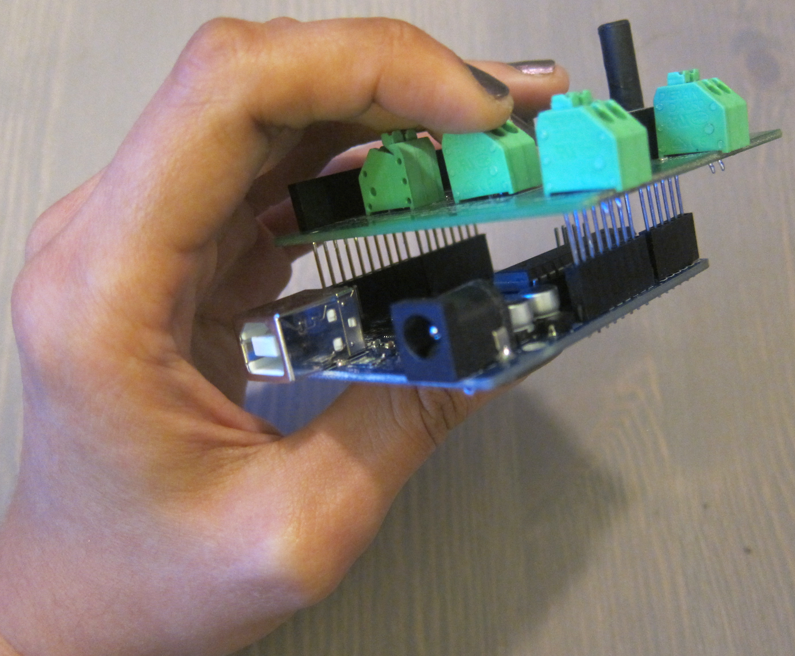

Make sure that each peg of the Shield lines up with a hole in the Arduino. 
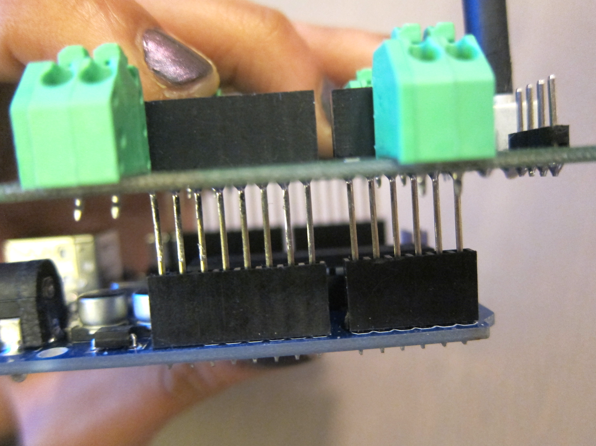

Push the two boards together all the way (there will still be some space between them). 
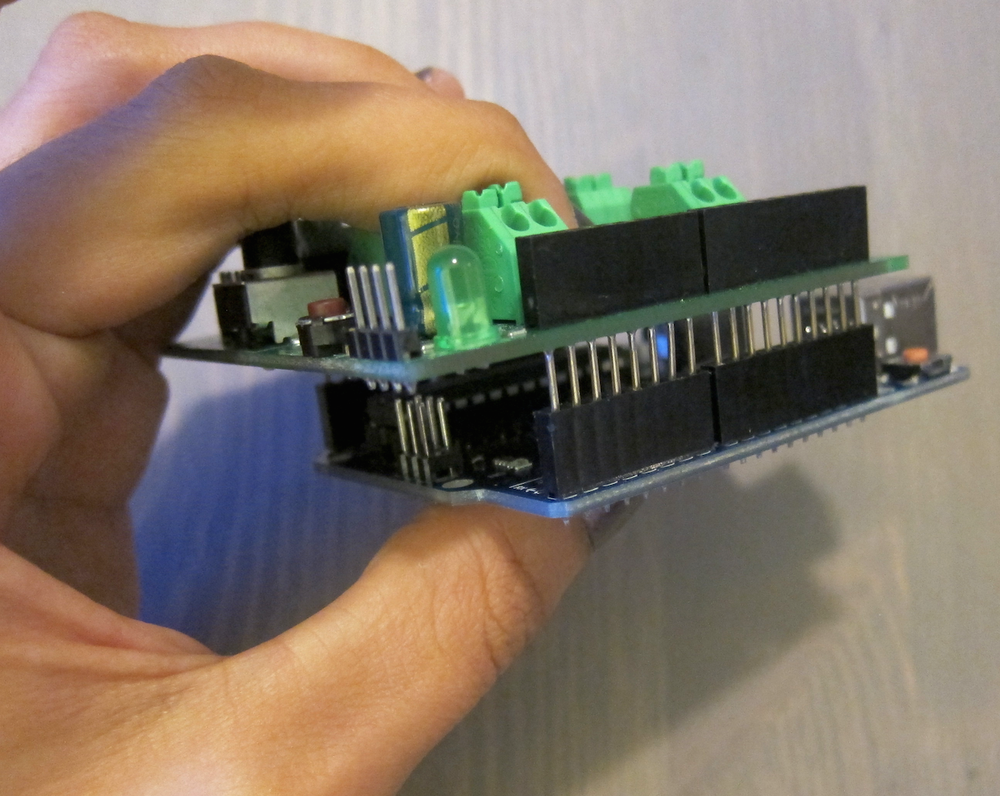

### 2. Connect the vibrator to the Shield

Next, we'll connect a vibrator (whichever of the 2 you prefer) to the Shield. Locate the clips marked "D5." 
 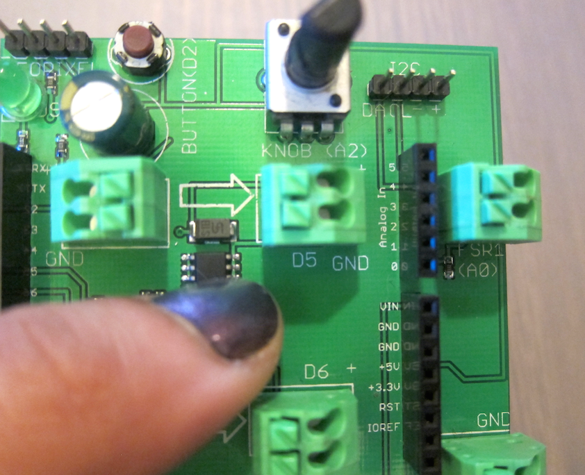

Hold down the D5 clips and insert the ends of the vibrator wires into the holes. You should be able to lightly tug on the wires without them falling out. 
 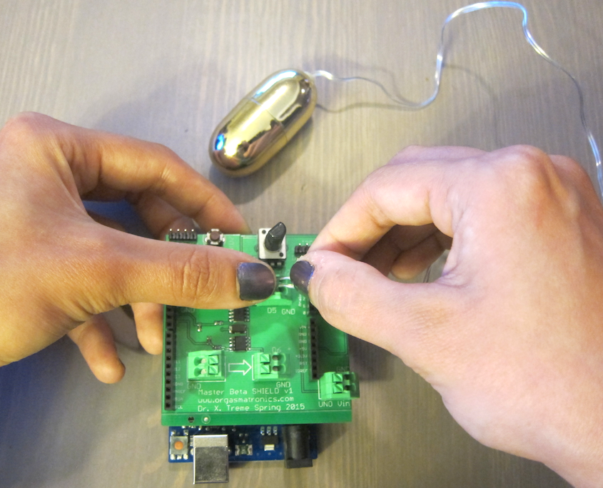

It's easier if someone helps :)
 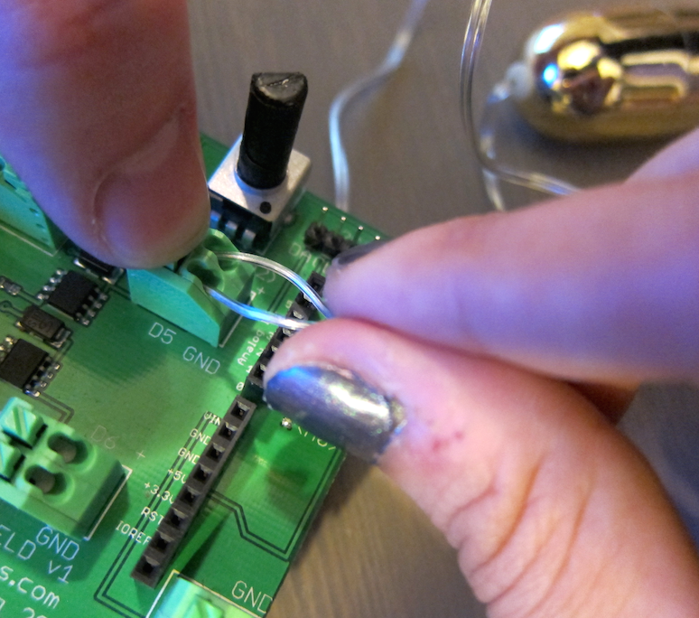

### 3. Connect the battery pack to the Shield

Locate the clips marked "Vin5" (it can be difficult to see the label). One end should be marked "GND." The black wire of the battery pack needs to attach to the "GND" hole and the red wire into the other.
 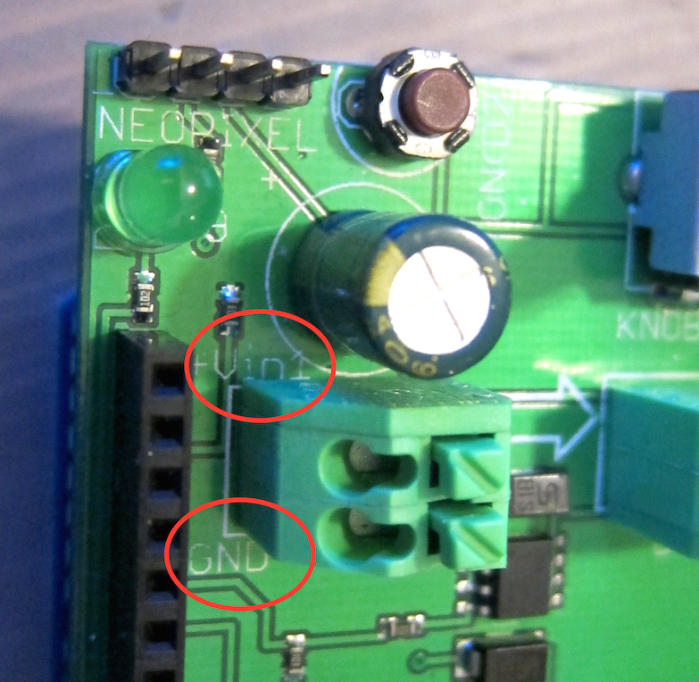

Hold the clips down and insert the wires the same way we did with the vibrator wires.
 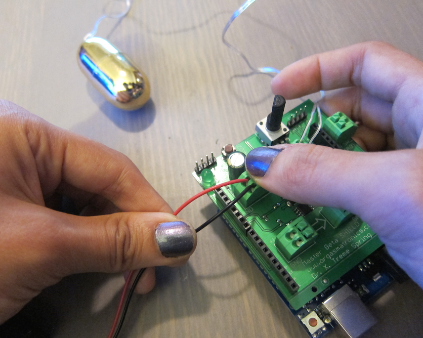

Check that the battery pack is switched off.
 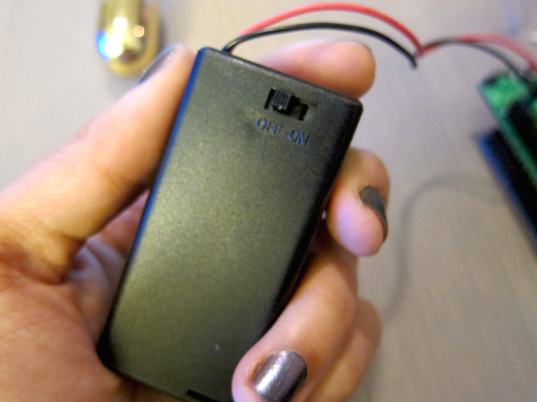

Insert 2 AA batteries into the battery pack.
 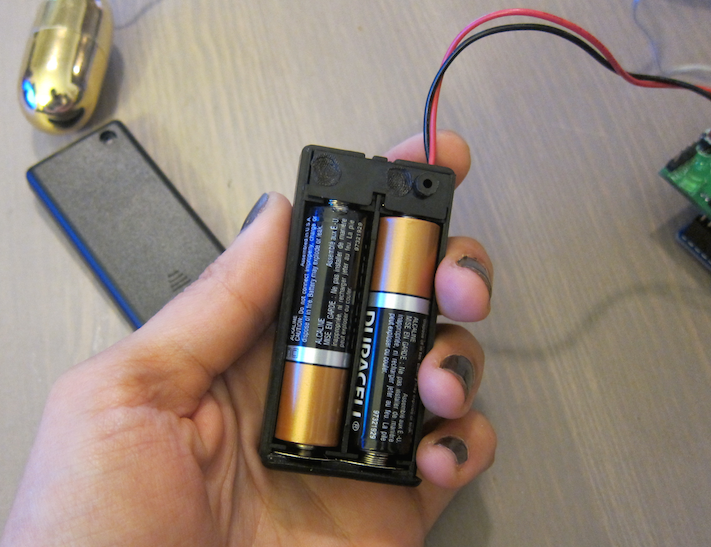

### 4. Connect the Arduino to your computer

Connect the square end of the USB cable to the Arduino.
 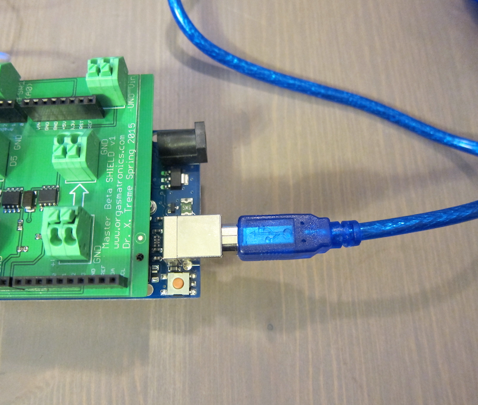

Connect the other end of the USB cable to a USB port on your computer.
 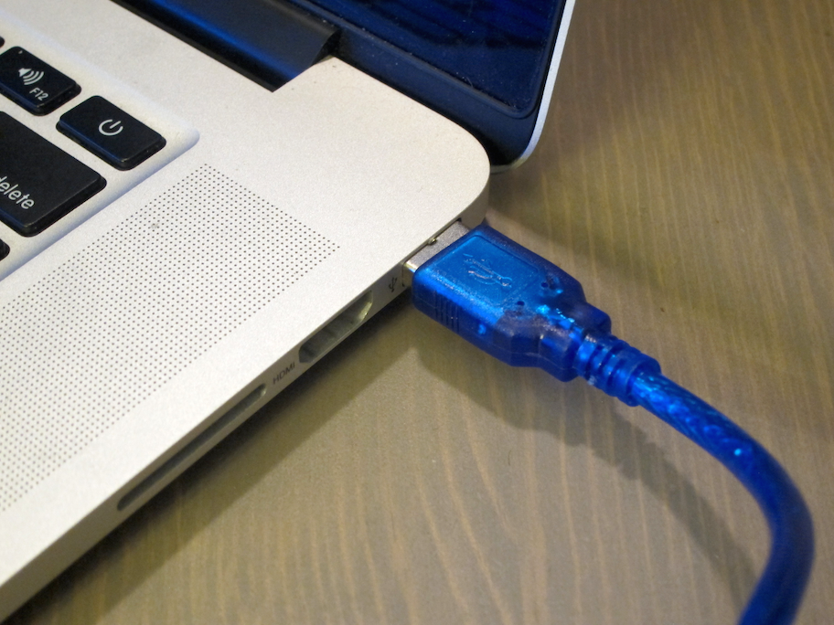

# You're ready to program!
