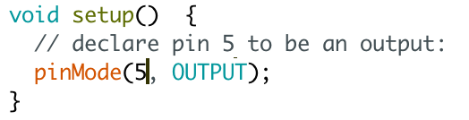
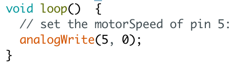

# What an Arduino Program Looks Like
Every Arduino program has two parts: a setup and a loop. 
 
The setup for all our programs will look like this today. The setup function is the first thing that runs. Here, we're taking pin 5, the pin that our vibrator motor is connected to, and declaring it as the output for our program.

 
Here's what a loop looks like...that doesn't do anything yet! Right now, it's setting pin 5 to 0 intensity, so no vibration at all. We'll add to it in the next chapter. The loop starts after the setup function finishes, and repeats itself forever and ever, or until you turn the battery off.